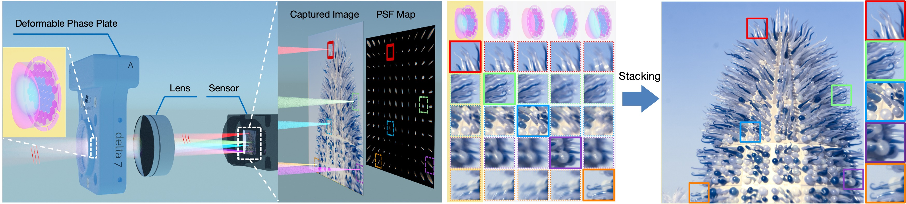
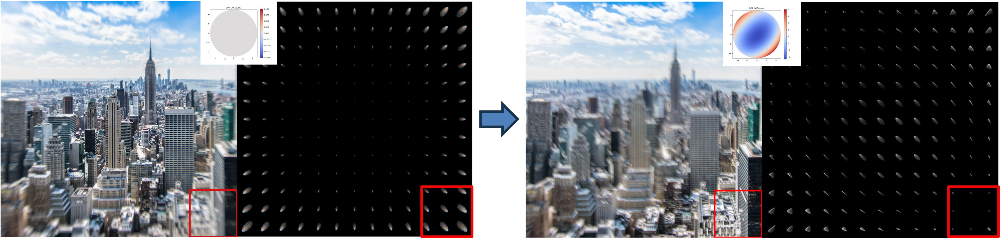
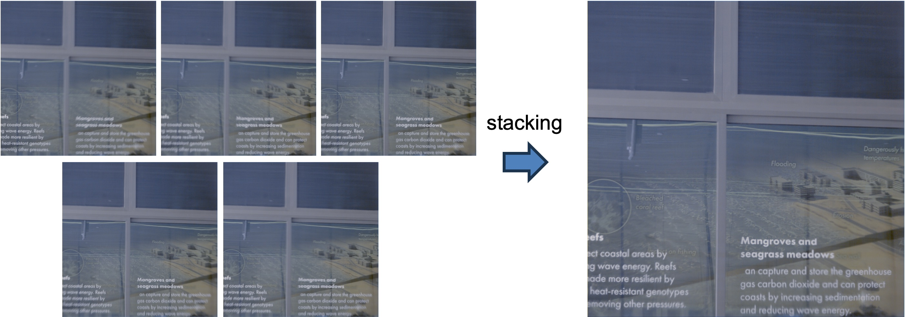
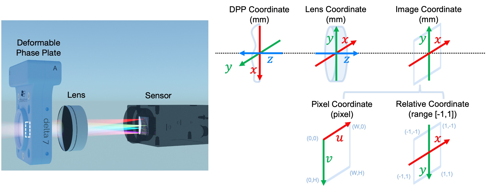

# Fovea Stacking

> [**Fovea Stacking: Imaging with Dynamic Localized Aberration Correction**](https://arxiv.org/abs/2506.00716)  <br>
> [Shi Mao](https://sheldonmao.github.io/), [Yogeshwar Nath Mishra](https://vccimaging.org/People/ynmishra/), [Wolfgang Heidrich](https://vccimaging.org/People/heidriw/)<br> 
> King Abdullah University of Science and Technology (KAUST) <br>
> ACM Transactions on Graphics (SIGGRAPH Asia), 2025  <br>
<p>
    <a href="https://sheldonmao.github.io/projects/FoveaStacking/index.html" alt="webpage">
        
    </a>
    <a href="https://arxiv.org/abs/2506.00716">
        
    </a>
</p>

<p align="center">
    
</p>

**Fovea Stacking** is a novel imaging paradigm that dynamically controls a deformable phase plate (DPP) to locally compensate for lens aberrations (analogous to the eye's fovea), thus producing **regionally corrected** images that can be stacked to form an aberration-free composite image.


## News
- **Aug 2025**: **Fovea Stacking** was accepted as a journal paper at SIGGRAPH Asia 2025.

## Environment
``` bash
conda create -n foveastacking python=3.10
conda activate foveastacking
pip install -r code/requirements.txt 
```

## Quickstart

### 1. Optimize single DPP patterns for given Region of Interest (ROI)

Initialized as a flat surface without deformation, the DPP is optimized for a given `--ROI` (`[x, y, w, h]` defined in [relative coordinates](#system-modeling)).

<p align="center">
    
</p>

``` bash
cd code
python opt_DPP_ROI.py --ROI 0.6 0.6 0.4 0.4 
# Results are saved in `code/results/date-time-opt_DPP_ROI_[0.6,0.6,0.4,0.4]`
```

### 2. Optimize multiple DPP patterns to jointly cover the Field of View (FoV)

`--n_dpps` specifies the number of DPP patterns to be jointly optimized. All DPPs are initialized and optimized together to adaptively specialize in different regions.

https://github.com/user-attachments/assets/3227b3cb-5e62-41c4-97d4-74664f90f1dd

``` bash
cd code
python opt_DPP_joint.py --n_dpps 5
# Results are saved in `code/results/date-time-opt_DPP_joint_5DPPs`
```

### 3. Fovea Stacking

Stack multiple captured or simulated images. `--result_dir` is the folder containing the images, and `--img_list` specifies the suffix of the image files.

<p align="center">
    
</p>

``` bash
cd code
python fovea_stack.py --result_dir data/camera_captured --img_list *.jpg
# Results are saved inplace in `result_dir/fovea_stack`
```

### Advance Usage

For single or multiple DPP optimization, a `--config` configuration file can be specified to change the lens settings and optimization parameters. Two example configuration files and corresponding lens files are provided: one for lens settings focused at `60m` (hyperfocal) and another for a calibrated `652mm` distance.


## System Modeling

The **DeepLens** differentiable optics system operates in a right-handed physical coordinate system, referred to as the `Lens Coordinates` in the following diagram. The `DPP Coordinate` is defined locally, with its z-axis pointing towards its deformable surface. For images captured by the sensor, the `Image Coordinate` is a 2D coordinate in physical units, while the `Relative Coordinate` normalizes it by the sensor size (and flips the y-axis), and the `Pixel Coordinate` is scaled by the number of pixels accordingly. Note that the ROI is usually defined in `Relative Coordinates`.

<p align="center">
    
</p>

**Hardware Specifications**
Camera:[[GS3-U3-41C6C]](https://www.edmundoptics.com/p/gs3-u3-41c6c-c-1-grasshopper-usb-30-color-camera/30772/?srsltid=AfmBOoqxv6XseAoEI_D9N3GfgcIqSGylMBYRO1TxuNMdrqlyAN1DuNZF)
Lens:[[AC254-050-A]](https://www.thorlabs.com/thorproduct.cfm?partnumber=AC254-050-A)
DPP: [[Phaseform Delta7]](https://www.phaseform.com/delta-7)


## Citation
Please consider citing our work if you find this codebase useful.

```bibtex
@article{mao2025fovea,
      title={Fovea Stacking: Imaging with Dynamic Localized Aberration Correction},
      author={Mao, Shi and Mishra, Yogeshwar and Heidrich, Wolfgang},
      journal={arXiv preprint arXiv:2506.00716},
      year={2025}
}
```

###  Acknowledgement
The code for **differentiable optics** in this repository is based on [DeepLens](https://github.com/singer-yang/DeepLens).
